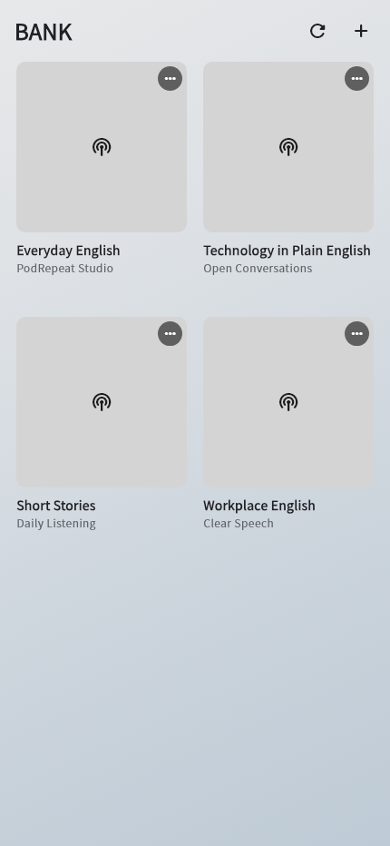
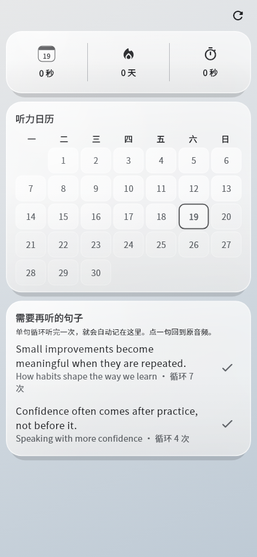
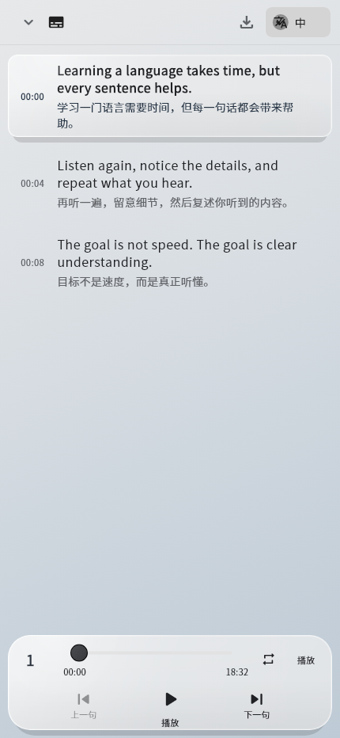

# PodRepeat — Repeat Podcast Sentences Until They Click

PodRepeat is a local-first podcast player for learners who want to study a few favourite shows carefully instead of constantly discovering new content.

## Product at a glance

| | |
| --- | --- |
| **Users** | English learners who study with podcasts |
| **Problem** | Normal podcast apps make it difficult to find, replay, and understand one spoken sentence |
| **Core experience** | Tap a transcript sentence, repeat it until it becomes clear, then return to it from a personal review list |
| **Product choice** | A focused RSS library instead of an endless recommendation feed |
| **Privacy model** | Playback, transcripts, translations, and history stay on the device during normal use |

The interface and learning flow are intentionally designed around repeated listening rather than passive playback.

## See it working

| Podcast library | Repeated-sentence review | Timestamped transcript |
| --- | --- | --- |
|  |  |  |

[Download the latest Android APK](https://github.com/BitForLI/language-learning-podcast-app/releases/latest/download/podrepeat-android.apk)

## Highlights

- Subscribe to up to ten RSS feeds and search Apple Podcasts.
- Repeat a sentence, paragraph, or whole episode without switching audio sources.
- Automatically collect repeated sentences in a local review list, ordered by repeat count; tap to replay from the original timestamp or remove a sentence when it is learned.
- Generate English transcripts on supported Android devices with NVIDIA Parakeet.
- Translate transcripts on-device with Google ML Kit on Android and iOS, after the required language models are downloaded.
- Import Podcasting 2.0 transcripts in VTT, SRT, or JSON format.
- Restore the last episode, playback position, and speed after restarting.
- Keep subscriptions, episode metadata, transcripts, translations, and history in the app's private storage.
- Export transcript text and available translations as a TXT file.

The mobile app talks directly to RSS and podcast services. The older FastAPI implementation remains under `backend/` as a tested reference, but it is not required at runtime.

## Implementation references

The [playback controller](lib/features/player/application/playback_controller.dart)
loops sentence and paragraph ranges on the original episode timeline rather
than loading separate clips. The [transcript controller](lib/features/player/application/transcript_controller.dart)
binds generated subtitles to [retained audio](lib/features/player/data/transcript_audio_store.dart)
before enabling synchronized navigation. [Playback tests](test/playback_controller_test.dart)
and [audio-binding tests](test/transcript_audio_store_test.dart) cover those boundaries.

[Android transcription](lib/features/player/data/mobile_on_device_transcriber.dart)
uses sherpa-onnx with Parakeet and Silero voice-activity detection in an isolate,
publishing partial subtitles as audio chunks complete. The
[automatic runner](lib/features/player/application/automatic_transcription_runner.dart)
processes the newest five episodes and continues after individual failures.
Models and episode audio require network downloads before local recognition.

The [local repository](lib/features/library/data/local_podcast_repository.dart)
persists app state and reads RSS directly; [transcript parsing](lib/features/player/data/local_transcript.dart)
supports VTT, SRT, and JSON import. [ML Kit translation](lib/features/player/data/mobile_transcript_translator.dart)
and [TXT export](lib/features/player/data/subtitle_exporter.dart) are separate
paths. Imported transcripts are readable, but the current synchronized-player
path requires a transcript bound to its retained recording. These are
implementation and fixture-test claims, not measured speech-recognition accuracy.

The [review list](lib/features/progress/domain/review_sentence.dart) records a
sentence only when a timed sentence loop reaches its end. Counts and timestamps
are stored locally; removing a subscription also removes its review entries.

## Run

```bash
flutter pub get
flutter run
```

No API base URL is required.

## Verify

```bash
flutter analyze
flutter test
cd backend
python -m pytest tests -q
```

## Build for Android

```bash
flutter build apk --release
```

The existing Dart package name `listen`, Android application ID
`com.listenapp.listen`, and local storage filename are retained so existing
imports and installations remain compatible.
